# LAPORAN PRAKTIKUM PWL
### Nama : Mochammad Zakaro Al Fajri
### Kelas   : 2F
### No.absen : 19
---
## Jobsheet 2 : ROUTING, CONTROLLER, DAN VIEW

### Praktikum 1 : Basic Routing
- Buka browser, tuliskan URL untuk memanggil route tersebut: localhost/PWL_2024/public/hello. Perhatikan halaman yang muncul apakah sudah sesuai dan jelaskan pengamatan Anda.

    Jawab : Sudah sesuai dengan yang diharapkan. Untuk tampilannya, muncul string "Hello World" sesuai dengan return value pada route /hello. 

    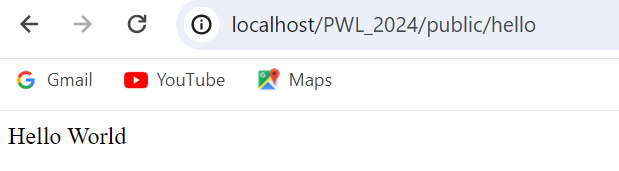

- Bukalah pada browser, tuliskan URL untuk memanggil route tersebut: localhost/PWL_2024/public world. Perhatikan halaman yang muncul apakah sudah sesuai dan jelaskan pengamatan Anda.

    Jawab : 
    Sudah sesuai. Penggunaan http verb berhasil karena dapat menampilkan output sesuai dengan retuen value
    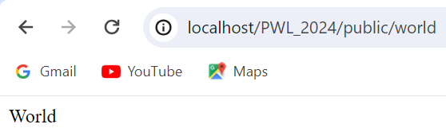

- Selanjutnya, cobalah membuat route ’/’ yang menampilkan pesan ‘Selamat Datang’.

    Jawab : 

    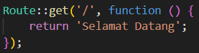

- Kemudian buatlah route ‘/about’ yang akan menampilkan NIM dan nama Anda.
    
    Jawab : 
    
    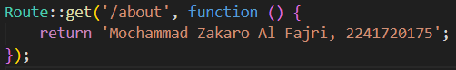

    hasil

    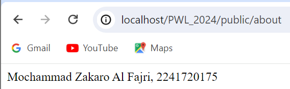

### Praktikum 2 : Route Parameters

- Jalankan kode dengan menuliskan URL untuk memanggil route tersebut: localhost/PWL_2024/public/user NamaAnda. Perhatikan halaman yang muncul dan jelaskan pengamatan Anda.

    Jawab : Muncul string dengan tulisan "Nama saya Kaka". Hal tersebut dapat terjadi karena route mengambil parameter {name} dan menampilkan pesan "Nama saya {name}"sesuai dengan inputan di url 

    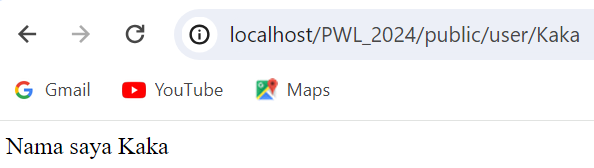

- Selanjutnya, coba tuliskan URL: localhost/PWL_2024/public/user/. Perhatikan halaman yang muncul dan jelaskan pengamatan Anda. 

    Jawab : muncul error. Hal tersebut dapat terjadi karena route sebelumnya didefinisikan menggunakan parameter {name}, sehingga diperlukan input melalui url sebagai nilai parameter {name}. Karena url tersebut tidak ada inputan menyebabkan request url tidak valid sehingga muncul error

    

- Jalankan kode dengan menuliskan URL untuk memanggil route tersebut: localhost/PWL_2024/public/posts/1/comments/5. Perhatikan halaman yang muncul dan jelaskan pengamatan Anda.
    
    Jawab : Muncul String "Pos ke-1 Komentar ke-: 5. Dalam langkah ini digunakan 2 parameter pada route yaitu {posts} dan {comments}. Dengan menggunakan url sebelumnya, Nilai 1 pada URL disematkan pada parameter {posts}, dan nilai 5 disematkan pada parameter {comments}. 
    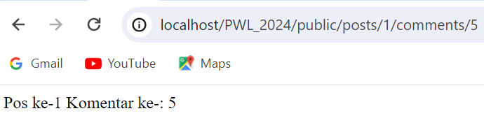

- Kemudian buatlah route /articles/{id} yang akan menampilkan output “Halaman Artikel
dengan ID {id}”, ganti id sesuai dengan input dari url.

    Jawab : 
    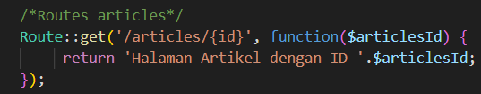
    Hasil
    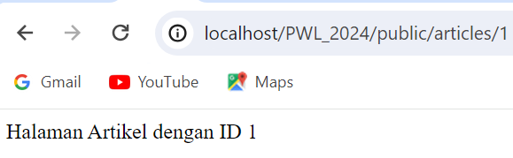

### Praktikum 3 : Optional Parameters

- Jalankan kode dengan menuliskan URL:localhost/PWL_2024/public/user. Perhatikan halaman yang muncul dan jelaskan pengamatan Anda.

   Jawab : Muncul string "Nama saya". Output seusuai dengan return value route karena tidak disertakannya nilai parameter {name?} yang bersifat opsional pada url,sehingga nilai parameter menjadi null
   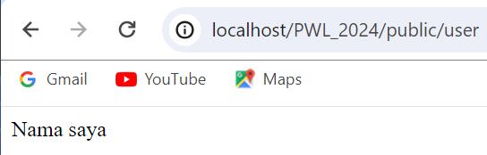

- Selanjutnya tuliskan URL: localhost/PWL_2024/public/user/NamaAnda. Perhatikan
halaman yang muncul dan jelaskan pengamatan Anda

    Jawab : Muncul string "Nama saya Kaka". Hal tersebut karena nilai parameter sudah diisi sehingga output sesuai dengan nilai parameter.

    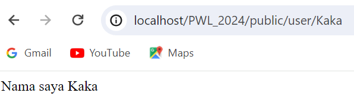

- Jalankan kode dengan menuliskan URL: localhost/PWL_2024/public/user/.
Perhatikan halaman yang muncul dan jelaskan pengamatan Anda.

    Jawab : Muncul string "Nama saya john". Hal tersebut bisa terjadi karena nilai parameter {name} ditetapkan opsional sehingga bisa diisi ataupun tidak. Nilai default {name} berupa string 'john'. Jika diisi, outputnya akan sesuai dengan niali parameter pada url. Apabila tidak, maka ouputnya akan sesuai dengan nilai default parameter yaitu john.
    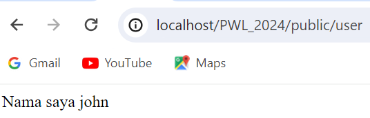

### Praktikum 4 : Membuat Controller

- Buka browser, tuliskan URL untuk memanggil route tersebut:
localhost/PWL_2024/public/hello. Perhatikan halaman yang muncul dan jelaskan
pengamatan Anda.

    Jawab : Muncul string "Hello world". Hal tersebut karena dengan penambahan WelcomeController, route akan menggunkana controller tersebut dan juga function yang ada didalamnya yaitu hello. 
    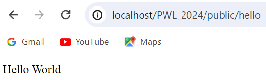

- Modifikasi kembali implementasi sebelumnya dengan konsep Single Action Controller.Sehingga untuk hasil akhir yang didapatkan akan ada HomeController,AboutController dan ArticleController. Modifikasi juga route yang digunakan.

    Jawab : 
    
    HomeController
    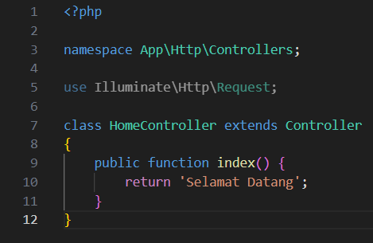
    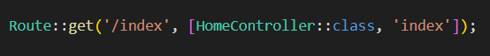
    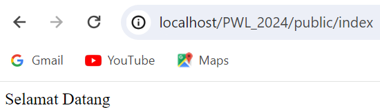
    
    AboutController
    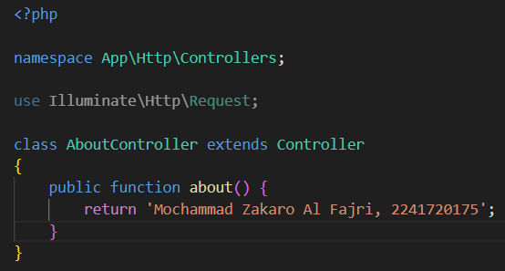
    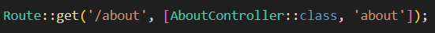
    

    ArticleController
    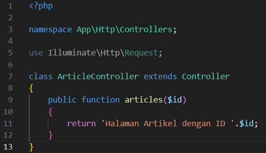
    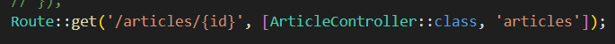
    

### Praktikum 5 : Membuat view

- Jalankan code dengan membuka url localhost/PWL_2024/public/greeting. Perhatikan halaman yang muncul dan jelaskan pengamatan Anda.

    Jawab :
    Muncul string "Halo, Andi" dengan Heading. Hal tersebut karena penggunaan view pada route greeting.  
    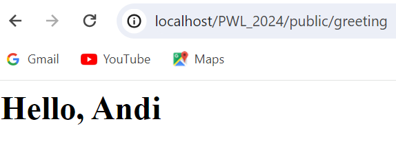

### Praktikum 6 : View dalam direktori
- Jalankan code dengan membuka url localhost/PWL_2024/public/greeting. Perhatikan halaman yang muncul dan jelaskan pengamatan Anda.

    Jawab :Output yang muncul adalah string "Hello, Andi". Ini membuktikan view dalam direktori bisa dilakukan. Konsepnya sama saja dengan praktikum 4 langkah c dengan menggunakan dot notation.
    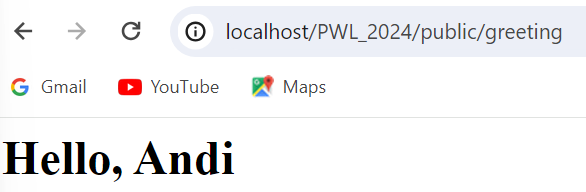

### Praktikum 7 : Menampilkan view dari controller
- Jalankan code dengan membuka url localhost/PWL_2024/public/greeting. Perhatikan halaman yang muncul dan jelaskan pengamatan Anda.

  Jawab : Pemanggilan view dari controller dilakukan dengan cara route langsungan melakukan pemanggilan function dari controller.
  

### Praktikum 8 : Meneruskan data ke view

- Jalankan code dengan membuka url localhost/PWL_2024/public/greeting. Perhatikan halaman yang muncul dan jelaskan pengamatan Anda.
   Jawab : Penggunaan with digunakan untuk menambah kan data invidual ke view dengan cara mengembalikan instance view object
   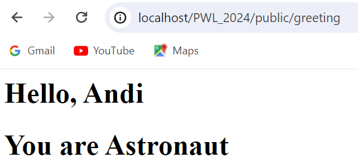

